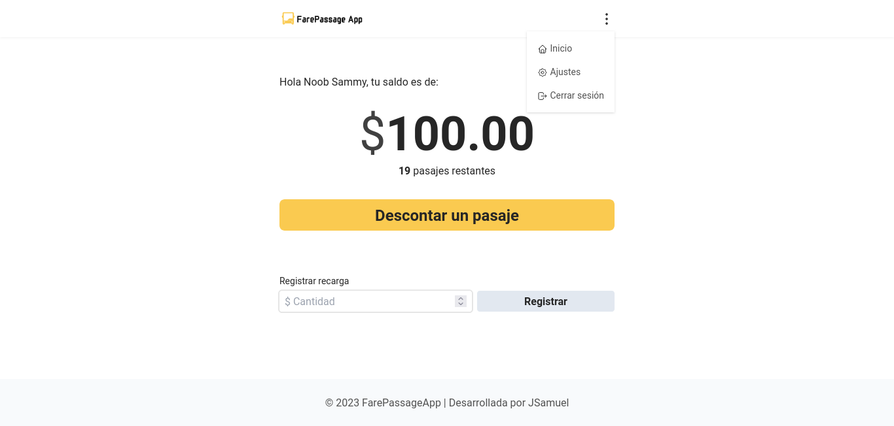

# FarePassage App 🚍

Aplicación Web Progresiva que facilita el seguimiento del saldo de tu tarjeta de transporte público.

## El problema ⚠️

En muchas ciudades de México la única forma de conocer el saldo de las tarjetas preferenciales para el transporte público es al momento de usarla o realizar una recarga, por lo que es común tener que recordar la última cantidad de saldo disponible o simplemente olvidarlo, y esto puede causar momentos donde la tarjeta se queda sin saldo en los momentos menos convenientes.

## ¿Cómo lo soluciona? 🤔

FarePassage App es una aplicación sencilla e intuitiva que permite mostrar el saldo de la tarjeta y la cantidad de pasajes restantes, de esta manera el usuario tendrá esta información accesible en todo momento y tomar decisiones a tiempo.

Entre las características de FarePassage App se encuentran:

- Mostrar el saldo actual
- Descontar pasaje
- Calcular el número de pasajes restantes
- Registrar recargas a la tarjeta
- Modificar el saldo actual
- Modificar la tarifa de pasaje
- Iniciar sesión con una cuenta de Google
- Persistencia de los datos
- Instalable en dispositivos móviles
- Offline
- Es una PWA

En resumen, el usuario cada vez que consuma un pasaje, podrá registrarlo fácilmente en la app para actualizar su saldo y pasajes restantes. Podrá hacerlo desde cualquier momento ya que la app se puede instalar como una aplicación nativa en su dispositivo móvil y funcionar sin conexión.

## Enlaces 🔗

- App: [FarePassage App](https://farepassage-app.web.app)
- Repositorio: [Github](https://github.com/JSamuelAP/farepassage-app)

## Tecnologías 🧰

- [React](https://reactjs.org/) - Librería de javascript
  - [React Router](https://reactrouter.com/en/main) - Enrutador para React
  - [PropTypes](https://www.npmjs.com/package/prop-types) - Validador de tipos de props
  - Hooks y Hokks personalizados
  - Context API
- [Tailwind CSS](https://tailwindcss.com/) - Framework CSS
  - [Prettier plugin Tailwind CSS](https://tailwindcss.com/blog/automatic-class-sorting-with-prettier) - Plugin para ordenar clases de Tailwind
- [Firebase](https://firebase.google.com) - Plaforma para el desarrollo de aplicaciones
  - Authentication
  - Firestore Database
  - Hosting
- [Vite](https://main.vitejs.dev/) - Herramienta de compilación
  - [PWA vite](https://vite-pwa-org.netlify.app/) - Plugin para la integración con PWA

## Qué aprendí 🧠

Principalmente aprendí dos cosas; **Firebase** y **PWA**. Utilicé Firebase ya que mi aplicación necesitaba persistir los datos del usuario, además de autenticación para que cada usuario tuviera acceso a sus datos, por lo que desarrollar un backend resultaría mayor trabajo, por lo que opte por un **BaaS** (Backend as a Service) como lo es Firebase que ya me proporciona las herramientas, así que tuve que aprender a integrarlo con mi aplicación, aprender la autenticación con Google y aprender Firestore, lo que a su vez me llevo a aprender más sobre las bases de datos **NoSQL**.

Y en cuanto a PWA aprendí más sobre su definición, sus utilidades, como configurar el **manifest.json**, sobre el **Service Worker**, los **iconos** necesarios para la aplicación y aprendí sobre el **plugin de vite** para convertir la app en una Progressive Web App.

## Autor ✒️

- Website - [JSamuel](https://jsamuelap.github.io)
- Github - [@JSamuelAP](https://github.com/JSamuelAP)
- Frontend Mentor - [@JSamuelAP](https://www.frontendmentor.io/profile/JSamuelAP)
- LinkedIn - [@JSamuelAP](https://www.linkedin.com/in/jsamuelap)
- Twitter - [@JSamuelAP](https://www.twitter.com/yourusername)
- Email - [sp4619168@gmail.com](mailto:sp4619168@gmail.com)
